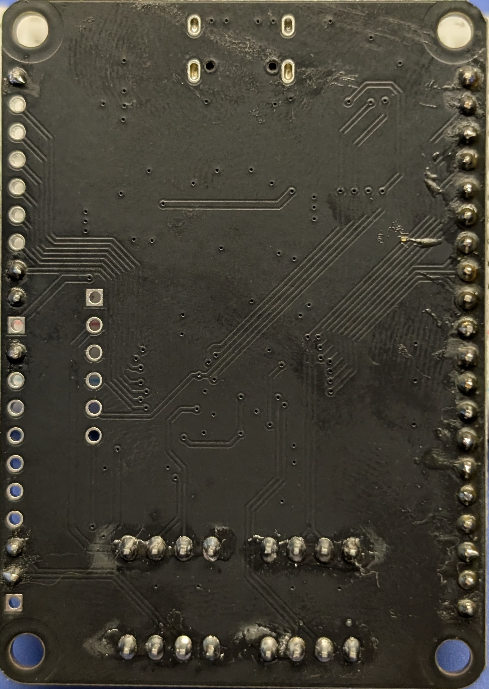
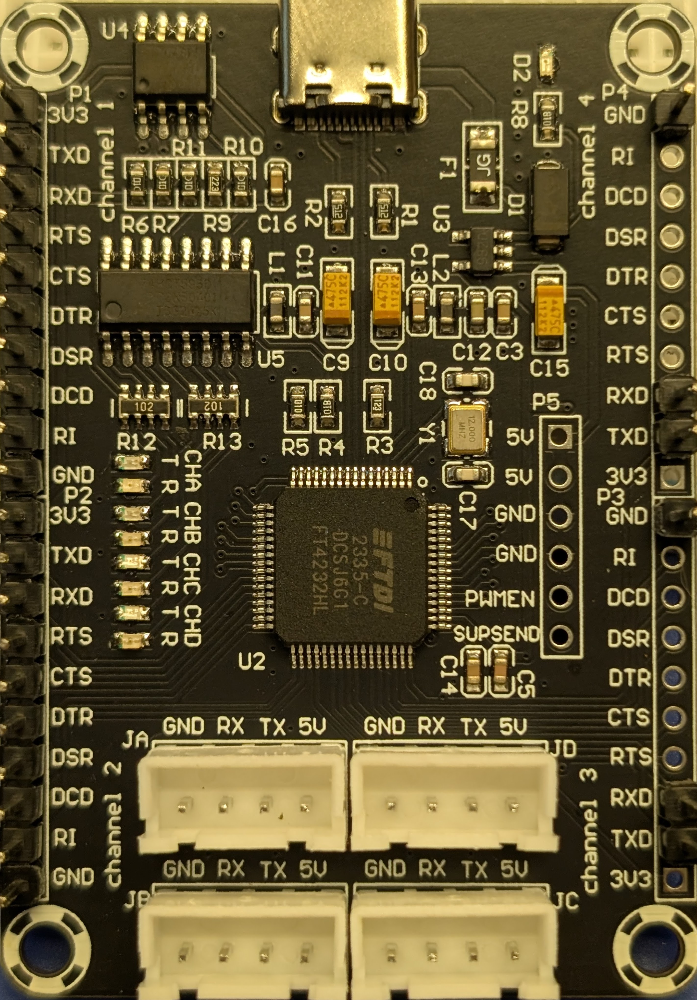
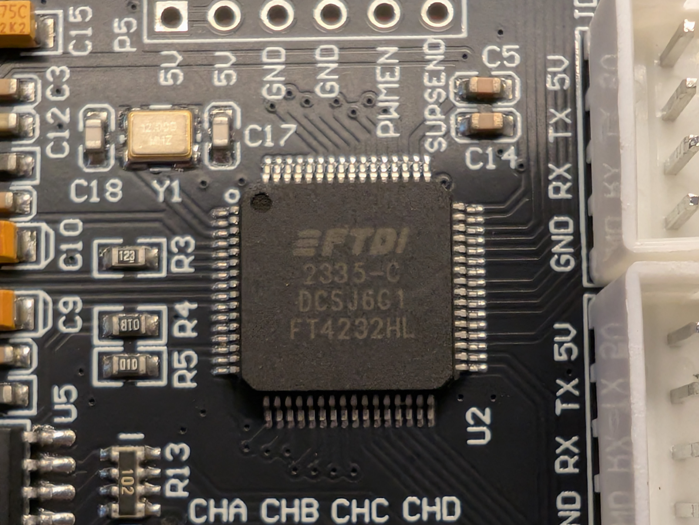
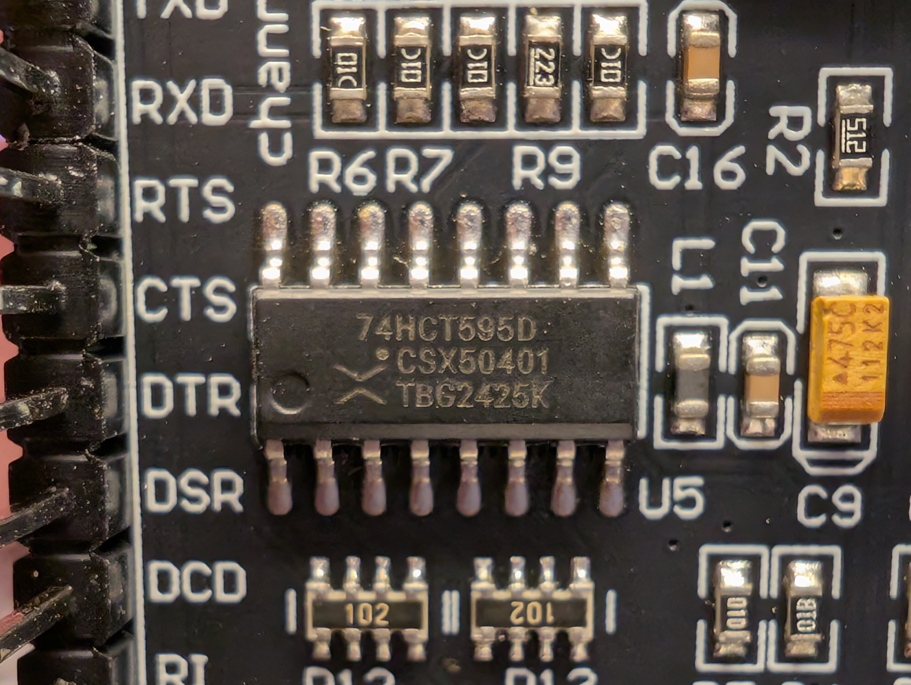
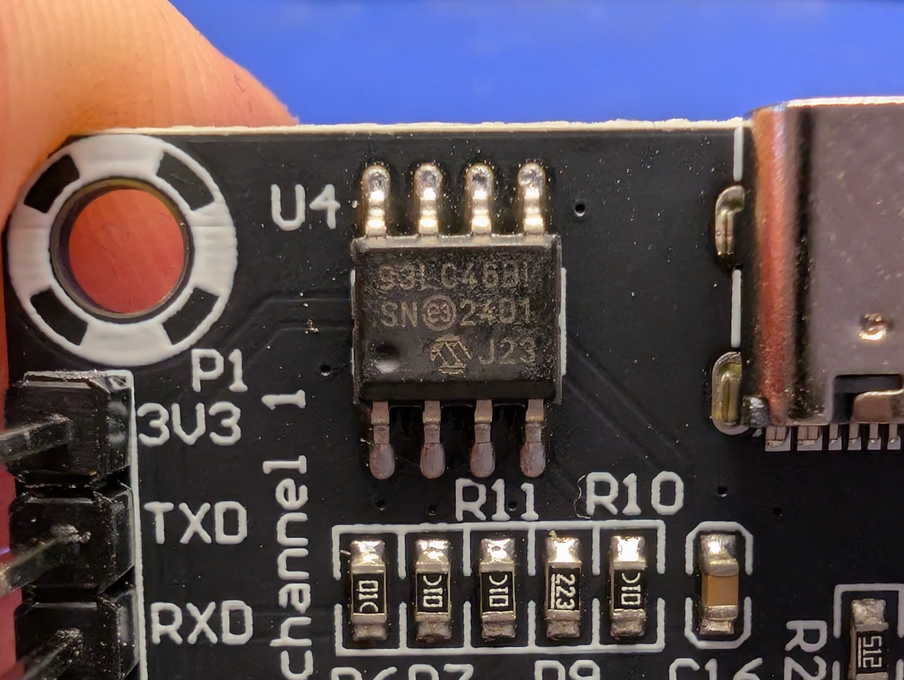

# Teyleten Robot FT4232HL-5V/3.3V





https://www.amazon.com/dp/B0DKTK5CHQ

## Board

Markings:

```text

```

### U2 FTDI FT4232HL



Package LQFP-64

Markings:

```text
FTDI
2335-C
DCSJ6G1
FT4232HL
```

Description ([datasheet]https://ftdichip.com/wp-content/uploads/2024/05/DS_FT4232H.pdf):

> The FT4232H is FTDI’s 5th generation of USB devices. 
> The FT4232H is a USB 2.0 High Speed (480Mb/s) to UART/MPSSE ICs.
> The device features 4 UARTs.
> Two of these have an option to independently configure an MPSSE engine.
> This allows the FT4232H to operate as two UART/Bit-Bang ports
> plus two MPSSE engines used to emulate JTAG, SPI, I2C, Bit-bang or other synchronous serial modes.

* 3.3V power and IO

### U2 Nexperia 74HCT595D



Package SO16 or TSSOP-16

Markings:

```text
74HCT595D
CSX50401
TBG2425K
```

Description ([datasheet](https://assets.nexperia.com/documents/data-sheet/74HC_HCT595.pdf)):
> The 74HC595; 74HCT595 is an 8-bit serial-in/serial or parallel-out shift register
> with a storage register and 3-state outputs.

* [DigiKey](https://www.digikey.com/en/products/detail/nexperia-usa-inc/74HCT595D-118/763163)
* This is the 5V version.


### Microchip 93LC46B 1 Kib Serial EEPROM



Package SOIC-8

Markings:

```text
93LC46BI
SN(e3)2401
     J23
```

Description ([datasheet](https://ww1.microchip.com/downloads/en/DeviceDoc/20001749K.pdf)):
> The Microchip Technology Inc. 93XX46A/B/C devices are 1Kbit low-voltage serial Electrically Erasable PROMs (EEPROM).


[4.2 Functional Block Descriptions](https://ftdichip.com/wp-content/uploads/2024/05/DS_FT4232H.pdf#page=18)
> Adding an external 93C46 (93C56 or 93C66) EEPROM allows
customization of USB VID, PID, Serial Number, Product Description Strings and Power Descriptor value of
the FT4232H for OEM applications. Other parameters controlled by the EEPROM include Remote Wake Up,
Soft Pull Down on Power-Off and I/O pin drive strength.

### Chip

(photo)

Package

Markings:

```text
```

[Datasheet]

Description (source):


### Pinout

| FTDI Pin | FTDI Signal | RS232 Signal | Board Pin | J Header |
|----------|-------------|--------------|-----------|----------|
| 16       | ADBUS0      | TXD          | P1.TXD    | JA.TX    |
| 17       | ADBUS1      | RXD          | P1.RXD    | JA.RX    |
| 18       | ADBUS2      | RTS#         | P1.RTS    |          |
| 19       | ADBUS3      | CTS#         | P1.CTS    |          |
| 21       | ADBUS4      | DTR#         | P1.DTR    |          |
| 22       | ADBUS5      | DSR#         | P1.DSR    |          |
| 23       | ADBUS6      | DCD#         | P1.DCD    |          |
| 24       | ADBUS7      | RI#/TXDEN#   | P1.RI     |          |
| 26       | BDBUS0      | TXD          | P2.TXD    | JB.TX    |
| 27       | BDBUS1      | RXD          | P2.RXD    | JB.RX    |
| 28       | BDBUS2      | RTS#         | P2.RTS    |          |
| 29       | BDBUS3      | CTS#         | P2.CTS    |          |
| 30       | BDBUS4      | DTR#         | P2.DTR    |          |
| 32       | BDBUS5      | DSR#         | P2.DSR    |          |
| 33       | BDBUS6      | DCD#         | P2.DCD    |          |
| 34       | BDBUS7      | RI#/TXDEN#   | P2.RI     |          |
| 36       | SUSPEND#    | -            | P5.6      | -        |
| 38       | CDBUS0      | TXD          | P3.TXD    | JC.TX    |
| 39       | CDBUS1      | RXD          | P3.RXD    | JC.RX    |
| 40       | CDBUS2      | RTS#         | P3.RTS    |          |
| 41       | CDBUS3      | CTS#         | P3.CTS    |          |
| 43       | CDBUS4      | DTR#         | P3.DTR    |          |
| 44       | CDBUS5      | DSR#         | P3.DSR    |          |
| 45       | CDBUS6      | DCD#         | P3.DCD    |          |
| 46       | CDBUS7      | RI#/TXDEN#   | P3.RI     |          |
| 48       | DDBUS0      | TXD          | P4.TXD    | JD.TX    |
| 52       | DDBUS1      | RXD          | P4.RXD    | JD.RX    |
| 53       | DDBUS2      | RTS#         | P4.RTS    |          |
| 54       | DDBUS3      | CTS#         | P4.CTS    |          |
| 55       | DDBUS4      | DTR#         | P4.DTR    |          |
| 57       | DDBUS5      | DSR#         | P4.DSR    |          |
| 58       | DDBUS6      | DCD#         | P4.DCD    |          |
| 59       | DDBUS7      | RI#/TXDEN#   | P4.RI     |          |
| 60       | PWREN#      | -            | P5.5      | -        |
| 61       | EEDATA      | -            | -         | -        |
| 62       | EECLK       | -            | -         | -        |
| 63       | EECS        | -            | -         | -        |


## As NAND Flash Reader


The FT4232HL has four ports (A, B, C, D). You will want to use Channel A or Channel B, as only those two support the high-speed MPSSE mode.
Wiring: You will map the 8 data lines (I/O0–I/O7) of your NAND flash chip to the 8 data pins of Channel A (ADBUS0–7). The control lines (ALE, CLE, RE#, etc.) will connect to the higher-order control pins on that same channel.
Software: Because this is a standard FTDI Hi-Speed chip, you can use high-performance C-based tools like ftdi-nand-flash-reader or flashrom (if supported). These tools use the libftdi driver to talk to the MPSSE engine, allowing you to dump the chip in minutes rather than hours.
Next Step: Since you have the FT4232HL, would you like the specific pin-mapping for Channel A to connect your NAND socket, or would you like help setting up the C-based driver on your computer to start the dump?

It looks like the example NAND flash chip,
Spansion S34ML01G200TFI00 ([datasheet](https://rocelec.widen.net/view/pdf/lgbffznp82/FASLS03877-1.pdf?t.download=true&u=5oefqw)),
wants 3.3V and 50 mA at peak,
so the FTDI board should be able to power it no problem.

### 8-bit Pinout

Write-protected

| Description          | NAND Signal | NAND Pin (TSOP-48) | FT4232H Signal | Board Pin |
|----------------------|-------------|--------------------|----------------|-----------|
| 8-bit Data Bus       | I/O0        | 29                 | ADBUS0         | P1.TXD    |
| ...                  | I/O1        | 30                 | ADBUS1         | P1.RXD    |
| ...                  | I/O2        | 31                 | ADBUS2         | P1.RTS    |
| ...                  | I/O3        | 32                 | ADBUS3         | P1.CTS    |
| ...                  | I/O4        | 41                 | ADBUS4         | P1.DTR    |
| ...                  | I/O5        | 42                 | ADBUS5         | P1.DSR    |
| ...                  | I/O6        | 43                 | ADBUS6         | P1.DCD    |
| ...                  | I/O7        | 44                 | ADBUS7         | P1.RI     |
| Command Latch Enable | CLE         | 16                 | BDBUS0         | P2.TXD    |
| Address Latch Enable | ALE         | 17                 | BDBUS1         | P2.RXD    |
| Write Enable         | WE#         | 18                 | BDBUS2         | P2.RTS    |
| Read Enable          | RE#         | 8                  | BDBUS3         | P2.CTS    |
| Chip Enable          | CE#         | 9                  | BDBUS4         | P2.DTR    |
| Ready / Busy         | R/B#        | 7                  | BDBUS5         | P2.DSR    |
| Write Protect        | WP#         | 19                 | GND            |           |
| 3.3V                 | VCC         | 12, 34, 37, 39     | 3V3            |           |
| Ground               | VSS         | 13, 25, 36, 48     | GND            |           |


### 16-bit Pinout

I guess 8-bit is more reliably available.

| Function         | NAND Pin | FT4232H Pin (Interface)      |
|------------------|----------|------------------------------|
| Data L (D0-D7)   | I/O 0–7  | ADBUS 0–7 (Interface 1)      |
| Data H (D8-D15)  | I/O 8–15 | BDBUS 0–7 (Interface 2)      |
| CLE (Cmd Latch)  | CLE      | CDBUS 0 (Interface 3)        |
| ALE (Addr Latch) | ALE      | CDBUS 1 (Interface 3)        |
| WE# (Write En)   | WE#      | CDBUS 2 (Interface 3)        |
| RE# (Read En)    | RE#      | CDBUS 3 (Interface 3)        |
| CE# (Chip En)    | CE#      | CDBUS 4 (Interface 3)        |
| R/B# (Busy)      | R/B#     | CDBUS 5 (Interface 3, Input) |

### PyFTDI

Wiring test.

```python
from pyftdi.gpio import GpioAsyncController
import time

# URLs for FT4232H ports
IF_DATA = 'ftdi://ftdi:4232h/1'  # Port A for 8-bit Data
IF_CTRL = 'ftdi://ftdi:4232h/2'  # Port B for Control Signals

class NandReader:
    def __init__(self):
        self.data_bus = GpioAsyncController()
        self.ctrl_bus = GpioAsyncController()

        # Configure: Data as output (initially), Ctrl as output
        self.data_bus.configure(IF_DATA, direction=0xFF)
        self.ctrl_bus.configure(IF_CTRL, direction=0x1F) # Pins 0-4 out, 5 in

    def send_cmd(self, cmd):
        self.ctrl_bus.write(0x11) # CLE=1, ALE=0, WE=1, RE=1, CE=0
        self.data_bus.write(cmd)
        self.ctrl_bus.write(0x15) # Pulse WE LOW (Bit 2)
        self.ctrl_bus.write(0x11) # WE back HIGH

    def read_byte(self):
        self.data_bus.set_direction(0xFF, 0x00) # Switch data bus to Input
        self.ctrl_bus.write(0x11) # RE=1
        self.ctrl_bus.write(0x01) # Pulse RE LOW (Bit 3)
        byte = self.data_bus.read()
        self.ctrl_bus.write(0x11) # RE back HIGH
        return byte

# Initialize and Read ID
nand = NandReader()
nand.send_cmd(0x90) # Read ID Command
# ... follow with address 0x00 and read cycles to get Manufacturer ID
```

For speed, use MPSSE:

```python
from pyftdi.ftdi import Ftdi

# 1. Open the device in MPSSE mode
ftdi = Ftdi()
ftdi.open_mpsse(url='ftdi://ftdi:4232h/1')

# 2. Build a "Command Buffer" for a single Page Read (2048 bytes)
# This buffer is sent in ONE USB transaction
cmd_buffer = bytearray()
for _ in range(2048):
    cmd_buffer.append(0x80) # Set Pins command
    cmd_buffer.append(0x00) # RE# LOW (Bit 3)
    cmd_buffer.append(0x1F) # Direction
    
    cmd_buffer.append(0x20) # READ DATA command (reads ADBUS pins)
    cmd_buffer.append(0x00) # (Standard 1-byte read length)
    
    cmd_buffer.append(0x80) # Set Pins command
    cmd_buffer.append(0x08) # RE# HIGH (Bit 3)
    cmd_buffer.append(0x1F) # Direction

# 3. Send the whole buffer at once
ftdi.write_data(cmd_buffer)
raw_data = ftdi.read_data(2048) # Get all 2048 bytes back in one go
```

You still have to do the ECC:
Path A: The "Raw Dump" (Easiest)
Read the full 2112 bytes (2048 data + 64 spare) for every page and save them to a file. This creates a "raw" image. You can then use a separate tool like nand-dump-tools or nandtool to calculate the ECC and extract the "clean" files later.

Path B: Software ECC in Python
You can incorporate a library like bchlib into your Python script. After reading a page via PyFtdi, you would run the 512-byte chunks through the BCH algorithm to check for and fix bit-flips before saving the data.
